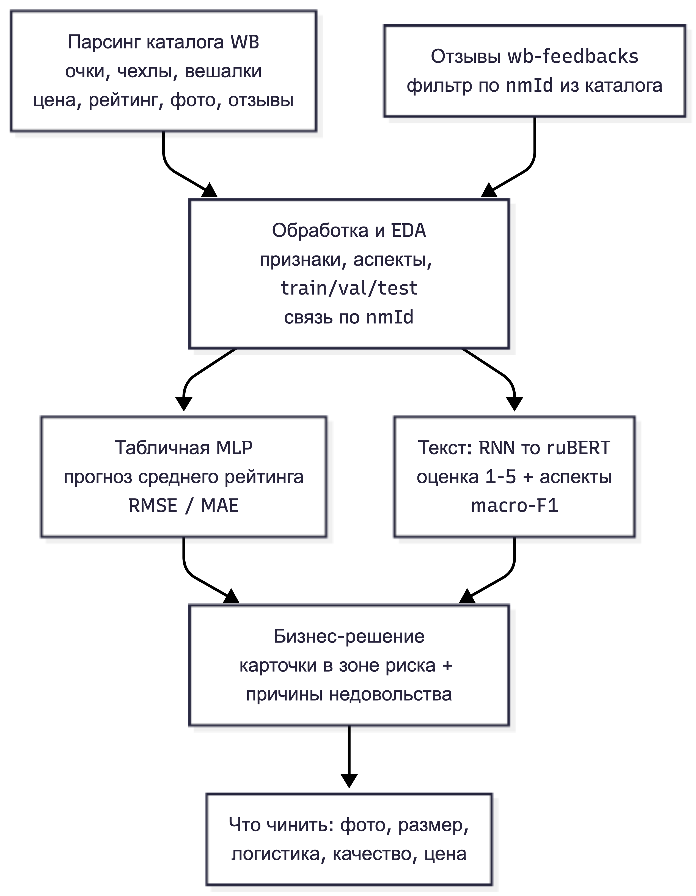

# Диагностика качества карточек на Wildberries

Рейтинг товара на WB тянет за собой конверсию и продажи. Нам нужно заранее видеть карточки, у которых рейтинг проседает, и понимать, что именно не нравится покупателям — чтобы чинить точечно: фото, размерную сетку, доставку, качество или цену

Решаем это двумя моделями на одних и тех же товарах (связь по `nmId`). Первая, табличная, по атрибутам карточки прикидывает её рейтинг. Он показывает, какие карточки в зоне риска. Вторая, текстовая, читает отзывы: ставит оценку и достаёт, на что жалуются. Первая находит проблему, вторая объясняет причину

Коротко по моделям:

| Модель               | Что делает                               | Данные                             | Метрика    |
| -------------------- | ---------------------------------------- | ---------------------------------- | ---------- |
| Табличная (MLP)      | прогноз среднего рейтинга по карточке    | парсинг 3 категорий                | RMSE / MAE |
| Текст (RNN → ruBERT) | оценка отзыва 1–5 + аспекты недовольства | отзывы из `wb-feedbacks` по `nmId` | macro-F1   |

На выходе — список карточек с низким прогнозным рейтингом, и по каждой топ-причины из отзывов. Получается приоритет: что чинить в первую очередь.
